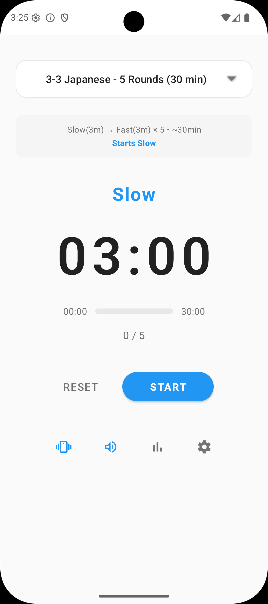
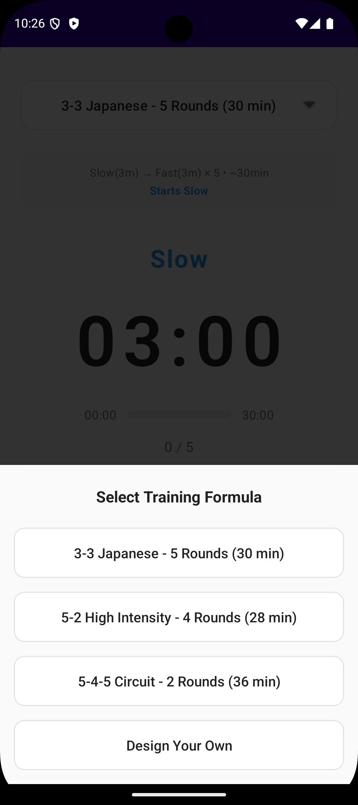
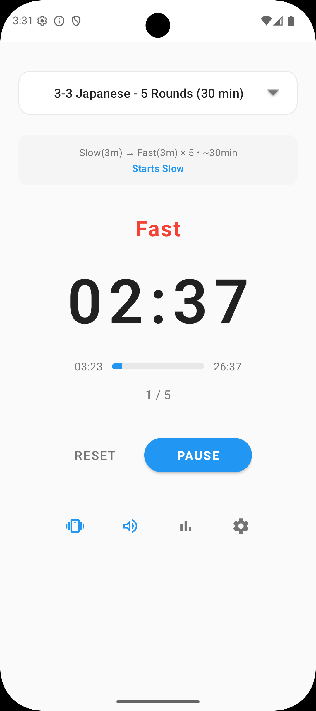

# Interval Walk Trainer

A minimalist Android app for interval walking training with customizable formulas, vibration, and voice notifications.

## Project Structure

```text
interval-walk-trainer/
├── app/                                    # Android app module
│   └── src/
│       ├── main/                           # Main source code
│       │   ├── java/com/oceanofmaya/intervalwalktrainer/  # Kotlin source files
│       │   └── res/                        # Android resources
│       │       ├── drawable/               # Icons and drawable graphics
│       │       ├── layout/                 # UI layout XML files
│       │       ├── values/                 # Colors, strings, themes
│       │       └── mipmap-*/               # Launcher icons
│       └── test/                           # Unit tests
│           └── java/com/oceanofmaya/intervalwalktrainer/
├── assets/                                 # Non-compiled assets
│   └── store/                              # Play Store publishing assets
│       └── screenshots/                     # Store listing screenshots
├── scripts/                                # Utility scripts for asset generation
├── gradle/                                 # Gradle wrapper files
└── .github/                                # GitHub workflows and templates
```

## Scripts

The `scripts/` directory contains utility scripts to automate asset generation:

- **`generate-app-icon.sh`** - Generates the 512x512px Play Store app icon
- **`generate-feature-graphic.sh`** - Generates the 1024x500px feature graphic
- **`generate-promotional-graphic.sh`** - Generates the 180x120px promotional graphic
- **`optimize-screenshots.sh`** - Optimizes screenshot file sizes

These scripts are utilities to automate the generation of Play Store assets and are not required for building or running the app.

**Requirements:**

- ImageMagick (`brew install imagemagick`)
- Python 3 (for icon/graphic generation scripts)

## Screenshots

<div align="center">
  
  
  
</div>

## Features

- Three pre-configured training formulas including Japanese 3-3 (IWT)
- **Design Your Own**: Create custom interval formulas with adjustable slow/fast durations, rounds, and starting phase
- Vibration patterns: gentle for slow, strong double-pulse for fast
- Voice notifications: optional text-to-speech announcements with early timing for perfect alignment
- **Themes**: System (follows device), Light, or Dark with easy cycling
- Runs in background: continues working when phone is locked
- Minimalist design with large, readable timer
- Progress tracking: current interval and total intervals
- Visual progress bar showing overall workout completion
- Elapsed and remaining time displays for clear progress feedback
- Icon-based controls for vibration, voice, and theme settings
- **Settings screen**: Access app version, Privacy Policy, Terms and Conditions, and theme selector
- **Workout statistics and history**
  - Calendar view showing workout days
  - Total workouts, minutes, and streaks
  - Monthly navigation to view past workouts
  - Clear all stats option

## Training Formulas

Three pre-configured formulas covering the main training patterns. Additional variations can be created using "Design Your Own". Formulas may start with either slow or fast phase as indicated.

1. **3-3 Japanese - 5 Rounds (30 min)**
   - Pattern: Slow(3m) → Fast(3m) × 5
   - Classic Japanese Interval Walking Training (IWT) method
   - Starts Slow
   - Default formula

2. **5-2 High Intensity - 4 Rounds (28 min)**
   - Pattern: Fast(5m) → Slow(2m) × 4
   - Starts Fast

3. **5-4-5 Circuit - 2 Rounds (36 min)**
   - Pattern: Fast(5m) → Slow(4m) → Fast(5m) × 2
   - Starts Fast

4. **Design Your Own** (Custom)
   - Create custom interval or circuit training formulas
   - **Interval Mode**: Simple alternating intervals
     - Slow duration: 1-60 minutes
     - Fast duration: 1-60 minutes
     - Rounds: 1-100
     - Choose to start with slow or fast phase
   - **Circuit Mode**: Three-phase circuit patterns
     - Slow duration: 1-60 minutes
     - Fast duration: 1-60 minutes
     - Rounds: 1-100
     - Choose pattern: Fast → Slow → Fast or Slow → Fast → Slow
   - Custom formulas are saved and persist across app restarts
   - Easy-to-use increment/decrement controls (no keyboard needed)
   - Toggle between Interval Mode and Circuit Mode with a simple switch

## Usage

1. Tap the formula button to open the selector and choose a training formula
   - Select from three pre-configured formulas, or
   - Choose "Design Your Own" to create a custom interval or circuit formula
2. Tap the vibration, voice, or theme icons to toggle settings (icons turn blue when active)
   - **Theme button**: Tap to cycle through System → Light → Dark themes
   - **Settings button** (info icon): Access Privacy Policy, Terms and Conditions, and theme selector
3. Tap **Start** to begin
4. Monitor progress using the progress bar and elapsed/remaining time displays
5. Use **Pause** or **Reset** as needed
6. The timer continues running even when the phone is locked
7. View your workout history and statistics by tapping the **Stats** icon
8. Navigate between months to see past workout history
9. Clear all stats anytime using the delete icon in the Stats screen

### Creating Custom Formulas

When you select "Design Your Own":

1. Choose **Interval Mode** (default) or **Circuit Mode** using the toggle switch
2. Use the **−** and **+** buttons to adjust slow duration (1-60 minutes)
3. Use the **−** and **+** buttons to adjust fast duration (1-60 minutes)
4. Use the **−** and **+** buttons to adjust rounds (1-100)
5. **For Interval Mode**: Select whether to start with slow or fast phase
6. **For Circuit Mode**: Select pattern (Fast → Slow → Fast or Slow → Fast → Slow)
7. Tap **Create** to load your custom workout
8. Tap **Start** when ready to begin

Your custom formula is automatically saved and will be restored when you restart the app.

## Requirements

- Android 7.0 (API 24) or higher
- Device with vibration capability (for vibration notifications)

## Building

**Development Requirements:**

- JDK 21
- Android Gradle Plugin 8.13.1
- Kotlin 2.0.21
- Android SDK (API 34)
- Gradle 9.0

To build:

```bash
./gradlew assembleDebug
```

Or open the project in Android Studio and build from there.

See [BUILD.md](BUILD.md) for detailed setup instructions.

## Testing

The project includes unit tests for core business logic. Tests are located in `app/src/test/java/`.

### Running Tests

**From command line:**

```bash
# Run all unit tests
./gradlew test

# Run specific test class
./gradlew test --tests "IntervalFormulaTest"
```

**Note**: If `./gradlew` is missing, open the project in Android Studio first - it will generate the Gradle wrapper automatically.

**From Android Studio:**

- Right-click the `test` folder → "Run Tests"
- Or use `Ctrl+Shift+F10` (Windows/Linux) / `Cmd+Shift+R` (Mac)

### Test Coverage

- **IntervalFormula**: Formula calculations, duration calculations, all formula definitions
- **IntervalTimer**: State management, phase transitions, start/pause/reset functionality
- **WorkoutRepository**: Workout recording, statistics calculation, data clearing
- **WorkoutRecord**: Data class properties and defaults

See [BUILD.md](BUILD.md) for detailed testing instructions.

## Permissions

The app requires the following permissions:

- `VIBRATE`: For vibration notifications
- `POST_NOTIFICATIONS`: For system notifications (Android 13+)
- `WAKE_LOCK`: To keep the timer running when the phone is locked

## Design

Minimalist interface with clean typography. Color coding: blue for slow phase, red for fast phase. Supports three themes:

- **System**: Automatically follows your device's theme setting
- **Light**: Always use light theme
- **Dark**: Always use dark theme

Theme preference is automatically saved and persists across app restarts.

## Capturing Screenshots

Screenshots are stored in `assets/store/screenshots/phone/` and used for both documentation and Play Store listings.

### Capture from Emulator

Capture screenshots manually from the Android Emulator:

1. Run app in Android Emulator
2. Navigate to the screen you want to capture
3. Click camera icon (📷) in emulator toolbar
4. Screenshots save to `~/Desktop/` or `~/Pictures/`
5. Move and rename to `assets/store/screenshots/phone/`

### File Naming Convention

Use the following naming pattern: `[screen]-[theme].png`

- `splash.png` - Launch/splash screen
- `home-light.png`, `home-dark.png` - Home screen
- `slow-light.png`, `slow-dark.png` - Timer slow phase
- `fast-light.png`, `fast-dark.png` - Timer fast phase
- `formula-light.png`, `formula-dark.png` - Formula selector
- `complete-light.png`, `complete-dark.png` - Timer completed state

### Image Requirements

**For README:**

- Format: PNG (preferred) or JPEG
- Max Width: 1080px
- Aspect Ratio: Match device (usually 9:16 for phone)
- File Size: < 500KB per image (after optimization)

**For Play Store:**

- Phone: 2-8 screenshots, 16:9 or 9:16 ratio
- 7-inch tablet: 2-8 screenshots (optional)
- 10-inch tablet: 2-8 screenshots (optional)
- Dimensions: 320px minimum, 3840px maximum

### Optimization

After capturing, optimize images to reduce file size:

```bash
./scripts/optimize-screenshots.sh
```

This requires ImageMagick:

```bash
brew install imagemagick
```

## License

See [LICENSE](LICENSE) file for details.

## Privacy Policy

See [PRIVACY.md](PRIVACY.md) for our privacy policy.

## Terms and Conditions

See [TERMS.md](TERMS.md) for our terms and conditions, including important medical disclaimer information.

**Note**: The app includes a medical disclaimer. Please consult with your healthcare provider before beginning any exercise program, especially if you have pre-existing medical conditions.
