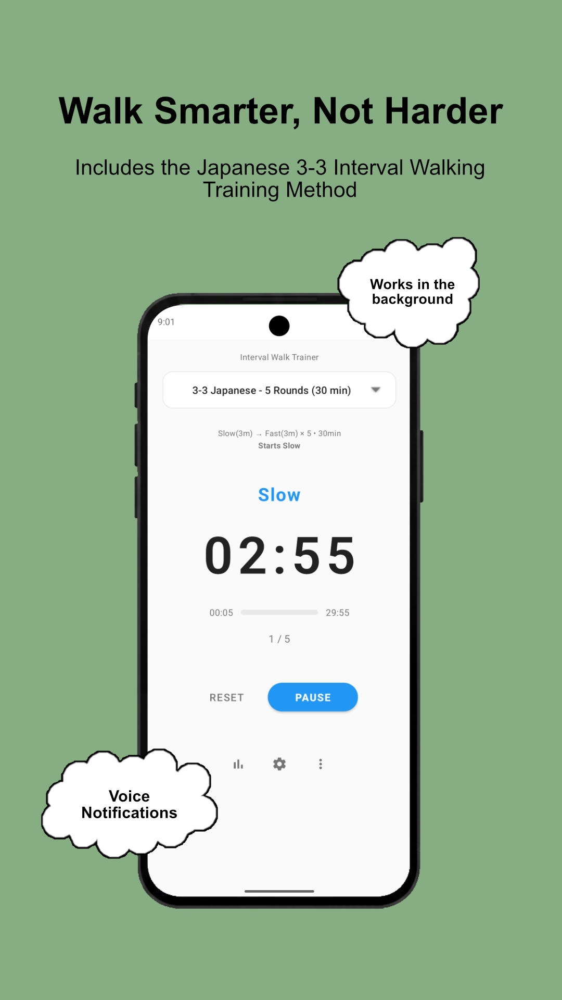
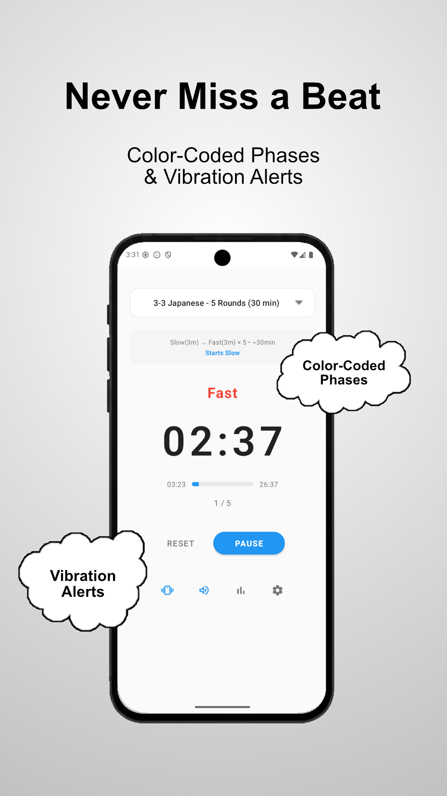
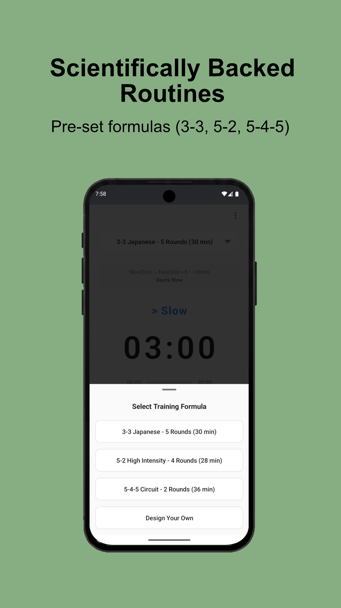

# Interval Walk Trainer

A minimalist Android app for interval walking training with customizable formulas, vibration, and voice notifications.

## Project Structure

```text
interval-walk-trainer-android/
├── app/                                    # Android app module
│   └── src/
│       ├── main/                           # Main source code
│       │   ├── java/com/oceanofmaya/intervalwalktrainer/  # Kotlin source files
│       │   └── res/                        # Android resources
│       │       ├── drawable/               # Icons and drawable graphics
│       │       ├── layout/                 # UI layout XML files
│       │       ├── values/                 # Colors, strings, themes
│       │       └── mipmap-*/               # Launcher icons
│       └── test/                           # Unit tests
│           └── java/com/oceanofmaya/intervalwalktrainer/
├── assets/                                 # Non-compiled assets
│   └── store/                              # Play Store publishing assets
│       └── screenshots/                     # Store listing screenshots
├── scripts/                                # Utility scripts for asset generation
├── config/                                 # Detekt and other tool config
├── gradle/                                 # Gradle wrapper files
└── .github/                                # GitHub workflows and templates
```

## Scripts

The `scripts/` directory contains utility scripts to automate asset generation:

- **`optimize-screenshots.sh`** - Optimizes changed phone screenshots by default; pass `--all` to optimize every phone screenshot

These scripts are utilities to optimize Play Store assets and are not required for building or running the app.

**Requirements:**

- ImageMagick (`brew install imagemagick`)
- Python 3 (for icon/graphic generation scripts)

## Screenshots

<div align="center">
  
  
  
</div>

## Features

- Three pre-configured training formulas including Japanese 3-3 (IWT)
- **Design Your Own**: Create custom interval or circuit workouts; optionally save up to 30 named presets under **My saved presets** in the picker (update, rename, duplicate, reorder, delete). This is separate from the **Save Workouts** setting, which controls workout **history**.
- Vibration patterns: gentle for slow, strong double-pulse for fast
- Voice notifications: optional text-to-speech announcements with early timing for phase changes
- **Themes**: System (follows device), Light, or Dark (selected in Settings)
- **Accent styles**: Blue, Teal, Purple, Amber or Magenta accent swatches in Settings
- Runs in background: continues working when phone is locked
- Minimalist design with large, readable timer
- Progress tracking: current interval and total intervals
- Visual progress bar showing overall workout completion
- Elapsed and remaining time displays for clear progress feedback
- Start/Pause/Reset controls and an overflow menu (⋮) for Workout History, Settings, Help, Rate App, and Report Issue; vibration and voice toggles in Settings; optional language-based picker for notification TTS
- **Pre-start countdown**: Configurable countdown (1-10 seconds) with voice and haptic cues before workout begins
- **Settings screen**: Access app version, theme and accent swatches, and toggles for vibration, voice, notifications, keep-screen-awake, countdown, and workout saving; pick the TTS notification language; links to FAQ (Help), Privacy Policy, and Terms of Service
- **Weekly Goals**: Set weekly workout and/or minute targets, see progress in Workout History, and choose insight cards on the home screen — **Weekly Goal**, **Current Streak**, **Today**, and **Last Workout** — for quick motivation between walks
- **Insight cards**: Choose which cards appear in the home screen **Insights** section (edit icon beside Insights, or Settings → Insight cards; up to five when more than five are available). Cards include **Weekly Goal**, **Current Streak**, **Today**, and **Last Workout**.
- **Workout reminders**: Schedule exact recurring reminder notifications for selected days and time when a weekly goal is active, with an option to pause reminders once the weekly goal is met
- **TTS languages:** Voice announcements (e.g. “Slow walk”, “Fast walk”, “Workout complete”) are spoken in the selected notification language when supported. Supported locales:
  - Arabic, Danish, Dutch, Filipino, French, German, Hindi, Indonesian, Italian, Japanese, Kannada, Korean, Malayalam, Polish, Portuguese (Brazil and Portugal), Russian, Simplified Chinese (China), Spanish, Swedish, Tagalog, Tamil, Telugu, Thai, Traditional Chinese (Hong Kong), Turkish, Urdu, Vietnamese
  - English is the default. Translations were AI-generated and may contain mistakes. Availability depends on installed voices and your device's TTS engine support.
- **Workout statistics and history**
  - Weekly Goal card showing current-week workout and minute progress
  - Calendar view showing workout days with a high-contrast today indicator
  - Total workouts, minutes, and streaks
  - Monthly navigation to view past workouts
  - Per-day workout detail with completion time; delete individual workouts or clear all history

## Training Formulas

Three pre-configured presets cover the main training patterns. **My saved presets** lists your saved custom presets (up to 30). One-off variations can be created with **Design Your Own** without saving. Presets may start with either slow or fast phase as indicated.

1. **3-3 Japanese - 5 Rounds** (30 min · Interval)
   - Pattern: Slow(3m) → Fast(3m) × 5
   - Classic Japanese Interval Walking Training (IWT) method
   - Starts Slow
   - Default formula

2. **5-2 High Intensity - 4 Rounds** (28 min · Interval)
   - Pattern: Fast(5m) → Slow(2m) × 4
   - Starts Fast

3. **5-4-5 Circuit - 2 Rounds** (28 min · Circuit)
   - Pattern: Fast(5m) → Slow(4m) → Fast(5m) × 2
   - Starts Fast

4. **Design Your Own** (Custom)
   - Create custom interval or circuit training formulas
   - **Interval Mode**: Simple alternating intervals
     - Slow duration: 1-60 minutes
     - Fast duration: 1-60 minutes
     - Rounds: 1-100
     - Choose to start with slow or fast phase
   - **Circuit Mode**: Three-phase circuit patterns
     - Slow duration: 1-60 minutes
     - Fast duration: 1-60 minutes
     - Rounds: 1-100
     - Choose pattern: Fast → Slow → Fast or Slow → Fast → Slow
   - After **Create**, choose **Save & use**, **Use without saving**, or **Save only** to control the library vs the active workout; the active custom formula still syncs to preferences for restore across restarts
   - Easy-to-use increment/decrement controls (no keyboard needed)
   - Toggle between Interval Mode and Circuit Mode with a simple switch

## Usage

1. Tap the formula button to open the picker and choose a preset
   - Select from three pre-configured presets, pick a row under **My saved presets**, or
   - Tap the sticky **Design Your Own** button at the bottom to build a custom interval or circuit workout (then Save & use, Use without saving, or Save only)
2. Open the overflow menu (⋮) next to the workout controls to manage app options in **Settings**:
   - Vibration and voice toggles for in-workout cues
   - Notifications permission and app notification state
   - Keep Screen Awake (foreground-only behavior)
   - Countdown on/off and countdown seconds (1-10)
   - Save Workouts toggle and theme selection (System, Light, Dark) with compact swatches
   - Accent selection (Blue, Teal, Purple, Amber, Magenta) for interactive UI highlights
   - Links to Privacy Policy, and Terms of Service
3. The overflow menu (⋮) also provides **Workout History**, **Help**, **Rate App**, and **Report Issue**
4. Tap **Start** to begin (a short countdown appears if enabled)
5. Monitor progress using the progress bar and elapsed/remaining time displays
6. Use **Pause** (button shows **Resume** when paused) or **Reset** as needed
7. The timer continues running even when the phone is locked
8. View workout history and statistics from **Workout History** in the overflow menu (⋮)
9. Tap **Weekly Goal** in Workout History, Settings, or the **Weekly Goal** insight card on the home screen to set weekly targets and optional recurring reminders
10. Tap a day in the calendar to see workout details; delete individual workouts from the detail sheet or clear all history from the Stats screen

### Weekly Goals

Weekly Goals are local planning targets. You can track workouts per week, minutes per week, or both. Only completed workouts that are saved to Workout History count toward the current week.

The home screen is organized into grouped sections: a workout setup card for formula selection, a bordered session panel that combines the timer with Start, Pause, Reset, and the overflow menu, and an **Insights** section at the bottom. Tap the edit icon beside **Insights** (or use **Settings → Insight cards**) to choose which cards appear there — up to five. The Weekly Goal card is available by default.

When the Weekly Goal insight card is enabled and a goal is active, it shows an icon status badge and radial progress rings for the enabled targets. When no goal is set, the card can still appear as a grayed-out preview with 0/0 workouts and minutes. Tap the card to edit the goal. The full Weekly Goal card in Workout History keeps the detailed status pill, progress bars, remaining-target text, and reminder summary.

Optional reminders repeat on the selected days at the selected time once a weekly goal is enabled with at least one target. Reminder options stay disabled in the editor until the goal is active. Reminder notifications open the home screen, respect Android notification permission, and can pause automatically once the weekly goal is met. On Android 12+, the app may ask for **Alarms & reminders** access so reminders can fire at the exact time you choose.

### Creating Custom Formulas

When you select "Design Your Own":

1. Choose **Interval Mode** (default) or **Circuit Mode** using the toggle switch
2. Use the **−** and **+** buttons to adjust slow duration (1-60 minutes)
3. Use the **−** and **+** buttons to adjust fast duration (1-60 minutes)
4. Use the **−** and **+** buttons to adjust rounds (1-100)
5. **For Interval Mode**: Select whether to start with slow or fast phase
6. **For Circuit Mode**: Select pattern (Fast → Slow → Fast or Slow → Fast → Slow)
7. Tap **Create**, then choose **Save & use** (adds to **My saved presets** and applies), **Use without saving** (applies only), or **Save only** (adds the preset to the picker without changing the current formula)
8. Tap **Start** when ready to begin

The active custom workout (when you use or save one) is kept in preferences so it can restore after an app restart.

### Saved Preset Behavior

Saved presets are reusable templates. Picking a row under **My saved presets** makes that preset the active workout until you pick something else, use an unsaved custom workout, or delete that preset.

- **Update & use** updates the preset and makes the updated version active.
- **Update** changes the preset in the library. If that preset is currently active and the timer has not started, the home screen refreshes to the new values. If the timer is running or paused, the app asks before updating because confirming will reset the timer with the new values.
- **Use without updating** applies the edited values as an unsaved custom workout and leaves the saved preset unchanged.
- **Rename** changes the saved preset name. If that preset is active, the home screen label updates without resetting the timer.
- **Delete** removes the saved preset and offers **Undo**. If the deleted preset is active, the app confirms first, then keeps the current timer values as an unsaved custom workout so the deleted preset is not restored as active after an app restart.
- **Duplicate** creates a separate copy and does not change the active workout.

Workout history records the workout name shown when the session completes. Existing history entries are not renamed or rewritten when presets change.

## Requirements

- Android 7.0 (API 24) or higher
- Device with vibration capability (for vibration notifications)

## Building

**Development Requirements:**

- JDK 21
- Android Gradle Plugin 9.0.1
- Kotlin 2.3.10
- Android SDK (API 36)
- Gradle 9.3.1

To build:

```bash
./gradlew assembleDebug
```

Or open the project in Android Studio and build from there.

See [BUILD.md](BUILD.md) for detailed setup instructions.

## Testing

The project includes unit tests for core business logic. Tests are located in `app/src/test/java/`.

### Running Tests

**From command line:**

```bash
# Run all unit tests
./gradlew test

# Run specific test class
./gradlew test --tests "IntervalFormulaTest"
```

**Note**: If `./gradlew` is missing, open the project in Android Studio first - it will generate the Gradle wrapper automatically.

**From Android Studio:**

- Right-click the `test` folder → "Run Tests"
- Or use `Ctrl+Shift+F10` (Windows/Linux) / `Cmd+Shift+R` (Mac)

### Test Coverage

- **IntervalFormula**: Formula calculations, duration calculations, all formula definitions
- **IntervalTimer**: State management, phase transitions, start/pause/reset functionality
- **WorkoutRepository**: Workout recording, statistics calculation, data clearing
- **WorkoutRecord**: Data class properties and defaults
- **WorkoutSession**: Session state and timing
- **FormulaAdapter**, **WorkoutListAdapter**, **WorkoutDetailAdapter**: UI adapters
- **NotificationHelper**: Notification behavior

See [BUILD.md](BUILD.md) for detailed testing instructions.

## Permissions

The app requires the following permissions:

- `VIBRATE`: For vibration notifications
- `POST_NOTIFICATIONS`: For system notifications (Android 13+)
- `SCHEDULE_EXACT_ALARM`: For exact weekly goal reminder times on Android 12+
- `WAKE_LOCK`: To keep the timer running when the phone is locked
- `FOREGROUND_SERVICE`: To run active workouts reliably in the background
- `FOREGROUND_SERVICE_HEALTH`: Required for health/workout foreground service type on newer Android versions
- `ACTIVITY_RECOGNITION`: Required on newer Android versions for health-type foreground workout execution

## Design

Minimalist interface with clean typography. Slow/Fast phase labels use accent-colored glyph cues (`>` and `>>`) for quick scanning. Supports three themes and configurable accents in Settings:

- **System**: Automatically follows your device's theme setting
- **Light**: Always use light theme
- **Dark**: Always use dark theme

Theme preference is automatically saved and persists across app restarts.

## Capturing Store Screenshots

Store screenshots are organized in two layers:

- `assets/store/screenshots/phone/` - raw emulator captures (source assets)
- `assets/store/screenshots/promo/` - manually designed Play Store-ready promo images derived from phone screenshots

See [assets/store/SCREENSHOTS.md](assets/store/SCREENSHOTS.md) for the full workflow, naming standards, insight-card staging for home captures, keep/remove guidance, and update checklist. Store listing copy lives in [assets/store/PLAY_STORE_LISTING.md](assets/store/PLAY_STORE_LISTING.md).

## License

See [LICENSE](LICENSE) file for details.

## Privacy Policy

See [PRIVACY.md](PRIVACY.md) for our privacy policy.

## Terms of Service

See [TERMS.md](TERMS.md) for our terms of service, including important medical disclaimer information.

**Note**: The app includes a medical disclaimer. Please consult with your healthcare provider before beginning any exercise program, especially if you have pre-existing medical conditions.
